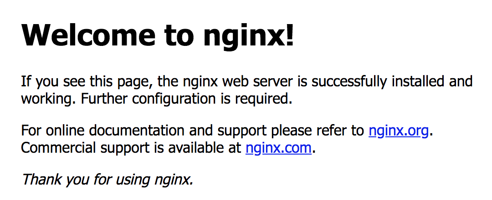
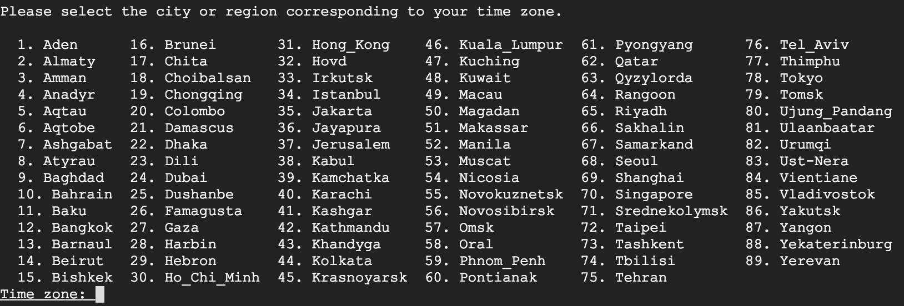
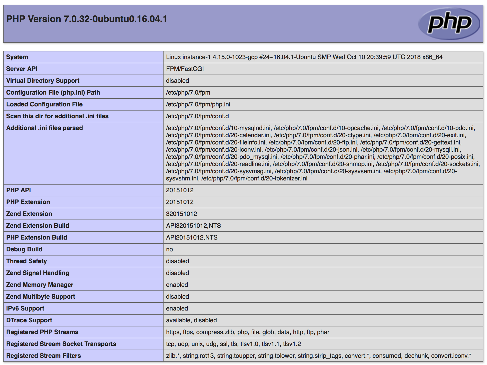
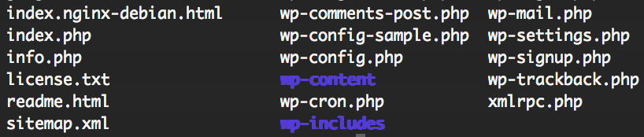

# How to migrate Wordpress to Google Cloud

Hello everybody, today I'll guide how to migrate (or install) Wordpress to Google Cloud (With Ubuntu server 16.04).

## 1. Install web server Nginx
``` bash
$ sudo apt-get update
$ sudo apt-get install nginx
```

Open your browser, and enter your server IP to test nginx. If you see as below picture, installing is sucessful.


## 2. Install PHP
Simple command
```bash
sudo apt-get install php-fpm php-mysql
```
During the installation, system requires input Geographic area


Then, choose TimeZone


Next, edit file *php.ini*, find row "cgi.fix_pathinfo=1", remove comment (;) and update value to 0
```bash
cgi.fix_pathinfo=0
```
Restart php service
```bash
sudo systemctl restart php7.0-fpm
```
Config nginx to use PHP
Open file at below path
```bash
sudo vim /etc/nginx/sites-available/default
```
add ***index.php*** into index row
```ini
index index.php index.html index.htm index.nginx-debian.html;
```
Add server_name at next row (you can user domain name or IP)
```ini
server_name hungson.net;
```
Add below to file (below location /)
```ini
location ~ \.php$ {
    include snippets/fastcgi-php.conf;
    fastcgi_pass unix:/run/php/php7.0-fpm.sock;
}

location ~ /\.ht {
    deny all;
}
```
Create PHP Info file (example filename is ***info.php***) to test PHP is worked or not. Save file at /var/www/html
```php
<?php
    phpinfo();
?>
```
Final, enter address on browser, with server_name you configured above
```bash
http://hungson.net/info.php
```
If website shows as below, you configured PHP successful.


## 3. Install MySQL
``` bash
sudo apt-get install mysql-server
```
During the installation, MySQL requires input password for root account.<br>
After install MySQL, you can test with command:
``` bash
mysql -u root -p
```
Enter password you inputed at step above


## 4. Dump database (SQL File) into MySQL
Create MySQL database
```bash
mysql> create database hungson_net;
```
You can copy sql file from local to server by ***scp***
```bash
scp database.sql hungson@192.168.2.5:/home/hungson/database.sql
```
Final, run command to import sql file to database
```bash
mysql -u root -p hungson_net < database.sql
```
Check database is imported successful or fail
```bash
mysql> use hungson_net;
mysql> show tables;
```


## 5. Copy Wordpress source to Google Cloud
Put all source code of Wordpress into folder **/var/www/html**. <br>
Note: this is root of website, because we configured root of hungson.net is **/var/www/html**.

In folder /var/www/html, you can see all source code of Wordpress, example as picture below:



## 6. Config Wordpress
If this is first time you install Wordpress, you input address to browser to start configuration. Otherwise, update file wp-config.php to connect MySQL:
```ini
define('DB_NAME', 'hungson_net');

/** MySQL database username */
define('DB_USER', 'root');

/** MySQL database password */
define('DB_PASSWORD', 'password');

/** MySQL hostname */
define('DB_HOST', 'localhost');

/** Database Charset to use in creating database tables. */
define('DB_CHARSET', 'utf8');

/** The Database Collate type. Don't change this if in doubt. */
define('DB_COLLATE', '');
```


## 7. Testing
Input your address (or IP) to browser, and enjoy. Example: http://hungson.net 
